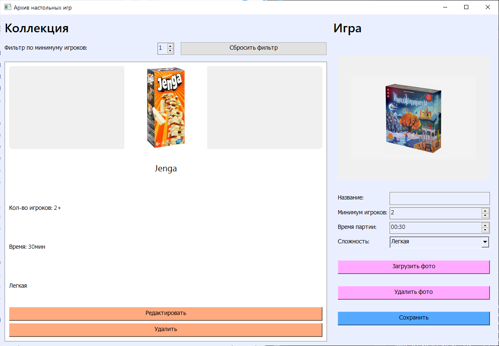
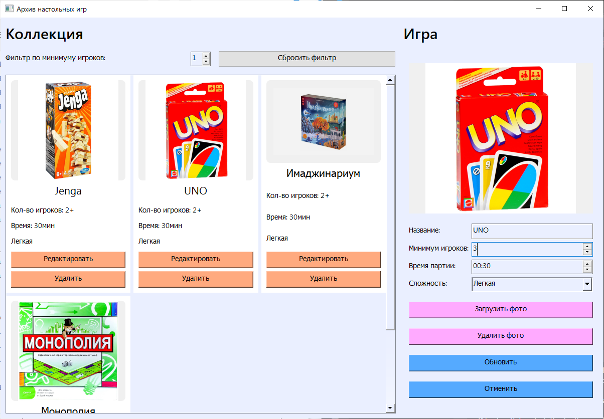
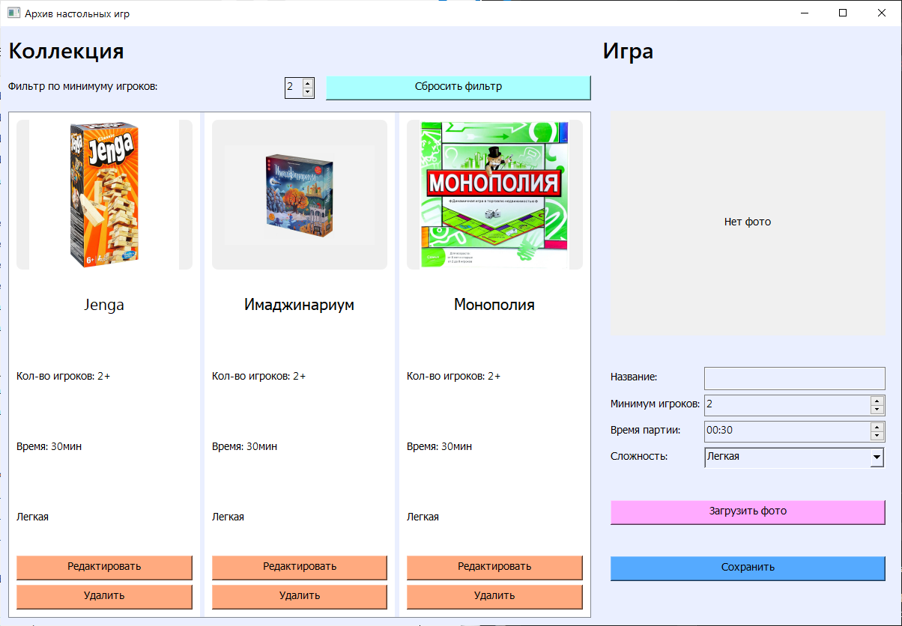

# Архив настольных игр
Приложение для каталогизации настольных игр с графическим интерфейсом на PyQt5.
## Возможности
- Просмотр коллекции игр в виде карточек
- Добавление новых игр
- Редактирование существующих игр
- Удаление игр
- Загрузка и отображение фото коробок игр
- Фильтрация по минимальному количеству игроков
## Установка
1. Клонируйте репозиторий:
```bash
git clone https://github.com/your-username/board-games-archive.git
cd board_games_archive
```
2. Создайте виртуальное окружение:
```bash
python -m venv venv
```
3. Активируйте виртуальное окружение:
```bash
source venv/bin/activate  ->  Для Linux/Mac
venv\Scripts\activate  ->  Для Windows
```
4. Установите необходимые библиотеки:
```bash
pip install -r requirements.txt
```
## Использование
### Запуск приложения
```bash
python main.py
```
### Работа с приложением
1. Просмотр коллекции: Все игры отображаются в виде карточек в левой части окна. Если игр в коллекции нет, в левой части окна написано соответствующее сообщение.
2. Добавление игры:
    - Заполните поля в правой части окна:
        + Название (обязательно)
        + Минимальное количество игроков (по умолчанию: 2)
        + Время партии (по умолчанию: 30 минут)
        + Сложность (Легкая/Средняя/Сложная) 
    - Нажмите "Загрузить фото" для добавления обложки (опционально)
    - Нажмите "Сохранить"
3. Редактирование игры:
    - Нажмите кнопку "Редактировать" на карточке игры
    - Измените необходимые поля
    - Нажмите "Обновить" для сохранения изменений или нажмите "Отменить" для отмены изменений
4. Удаление игры:
    - Нажмите кнопку "Удалить" на карточке игры
    - Подтвердите удаление в диалоговом окне
5. Фильтрация:
    - Выберите минимальное количество игроков в спин-боксе
    - Фильтр активируется автоматически при изменении значения
    - Активный фильтр подсвечивается синим цветом
    - Нажмите "Сбросить фильтр" для отображения всех игр
## Структура проекта
board_games_archive/
- main.py  ->  Точка входа в приложение
- ui_main.py  ->  Основной интерфейс на PyQt5
- database.py  ->  Модуль для работы с SQLite3
- archive.db  ->  Файл базы данных (создается автоматически)
- app.log  ->  Файл логов
- requirements.txt  ->  Зависимости проекта
- README.md  ->  Документация
## База данных
Приложение использует SQLite для хранения данных. Структура таблицы games:
```sql
CREATE TABLE games (
    id INTEGER PRIMARY KEY AUTOINCREMENT,
    name TEXT NOT NULL,
    players INTEGER NOT NULL,
    time INTEGER NOT NULL,  -> Время в минутах
    difficulty TEXT,
    photo_path TEXT  -> Путь к файлу изображения
)
```
База данных archive.db создается автоматически при первом запуске.
## Логирование
Все действия приложения логируются в файл app.log:
- Уровень логирования: INFO
- Формат: время - имя - уровень - сообщение
- Логи выводятся в консоль и файл
## Требования к системе
- Python 3.10 или выше
- Установленные зависимости из requirements.txt
## Визуальная демонстрация интерфейса
### Главное окно
Просмотр всех игр в виде карточек с возможностью фильтрации.
.png)
.png)
### Добавление игры
Интуитивно понятная форма для добавления новой игры в коллекцию.

### Редактирование игры
Возможность редактировать информацию о существующей игре.

### Фильтрация
Удобная фильтрация по количеству игроков.
